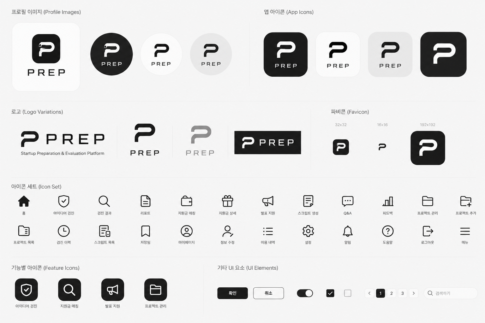

<div align="left">

# PREP

### Startup Preparation & Evaluation Platform  
AI 기반 창업 아이디어 검진 · 지원사업 매칭 · 발표 지원 플랫폼

<br/>



<br/><br/>

## ✨ 프로젝트 소개

**PREP**은  
예비 창업자를 위한 AI 기반 창업 통합 지원 플랫폼입니다.

사용자의 창업 아이디어를 분석하여:

- 사업 가능성 검진
- 규제 리스크 탐지
- 지원금 매칭
- 발표 스크립트 생성

까지 한 번에 지원합니다.

특히 헬스케어 · 웰니스 분야의  
복잡한 규제와 시장 구조를 쉽게 진단할 수 있도록 설계되었습니다.

<br/>

---

## 🎯 핵심 기능

### 🧠 아이디어 검진 AI

특허 API 및 AI 모델을 활용하여  
창업 아이디어의 사업 가능성과 리스크를 분석합니다.

- 간편 검진 / 정밀 검진
- PMF 기반 가능성 분석
- 규제 위험도 판정
- PDF 리포트 저장

<br/>

### 💰 지원금 정보 매칭

사용자 아이디어에 적합한  
정부 지원사업 및 창업 지원금을 추천합니다.

- 맞춤형 지원사업 추천
- 핵심 평가 포인트 제공
- 프로젝트별 매칭 관리

<br/>

### 🎤 발표 지원 시스템

LLM 기반 발표 지원 기능을 제공합니다.

- 발표 스크립트 자동 생성
- 예상 질문(Q&A) 생성
- 발표 피드백 제공
- VC / 정부 / 액셀러레이터 페르소나 지원

<br/>

---

## 🏥 웰니스 특화 서비스

PREP은 일반 창업 서비스가 아닌  
**웰니스·헬스케어 창업 특화 플랫폼**입니다.

### 핵심 차별점

- 의료기기 가능성 탐지 (GATE 모델)
- 식약처 기준 기반 분석
- 규제 리스크 경보 시스템
- 헬스케어 도메인 특화 분석
- 정부지원사업 연계

<br/>

### 주요 타겟

- 의대 / 약대 / 간호대 학생
- 헬스케어 직군 종사자
- 웰니스 예비 창업자
- 헬스케어 스타트업 준비팀

<br/>

---

## ⚙️ 서비스 흐름

```text
[1] 랜딩 페이지
        ↓
[2] 아이디어 입력
        ↓
[3] AI 분석 진행
        ↓
[4] 진단 리포트 생성
        ↓
[5] 저장 / 공유 / 프로젝트 관리
