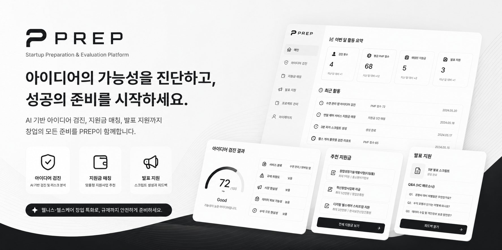

<div align="left">
<br/>



<br/><br/>
# 🚀 PREP

### Startup Preparation & Evaluation Platform  
AI 기반 창업 아이디어 검진 · 지원사업 매칭 · 발표 지원 플랫폼

## ✨ 프로젝트 소개

**PREP**은  
예비 창업자를 위한 AI 기반 창업 통합 지원 플랫폼입니다.

사용자의 창업 아이디어를 분석하여:

- 사업 가능성 검진
- 규제 리스크 탐지
- 지원금 매칭
- 발표 스크립트 생성

까지 한 번에 지원합니다.

특히 헬스케어 · 웰니스 분야의  
복잡한 규제와 시장 구조를 쉽게 진단할 수 있도록 설계되었습니다.

<br/>

---

## 🎯 핵심 기능

### 🧠 아이디어 검진 AI

특허 API 및 AI 모델을 활용하여  
창업 아이디어의 사업 가능성과 리스크를 분석합니다.

- 간편 검진 / 정밀 검진
- PMF 기반 가능성 분석
- 규제 위험도 판정
- PDF 리포트 저장

<br/>

### 💰 지원금 정보 매칭

사용자 아이디어에 적합한  
정부 지원사업 및 창업 지원금을 추천합니다.

- 맞춤형 지원사업 추천
- 핵심 평가 포인트 제공
- 프로젝트별 매칭 관리

<br/>

### 🎤 발표 지원 시스템

LLM 기반 발표 지원 기능을 제공합니다.

- 발표 스크립트 자동 생성
- 예상 질문(Q&A) 생성
- 발표 피드백 제공
- VC / 정부 / 액셀러레이터 페르소나 지원

<br/>

---

## 🏥 웰니스 특화 서비스

PREP은 일반 창업 서비스가 아닌  
**웰니스·헬스케어 창업 특화 플랫폼**입니다.

### 핵심 차별점

- 의료기기 가능성 탐지 (GATE 모델)
- 식약처 기준 기반 분석
- 규제 리스크 경보 시스템
- 헬스케어 도메인 특화 분석
- 정부지원사업 연계

<br/>

### 주요 타겟

- **헬스케어**에 관심은 있지만 규제와 시장 구조를 모르는 아이디어 단계 예비 창업자
  
| 페르소나         | 특징         | 핵심고민    |
| ---------- | ------------- | ------------|
| 의대, 약대, 간호대 학생 | 임상 경험 있음, 창업 처음 | "이 아이디어가 사업이 될까?" |
| 헬스케어 직군 직장인 | 현장 문제 앎, 사업화 모름 | "규제에 걸리는 건 아닐까?" |
| 일반 예비 창업자 | 헬스케어가 유망하다고 들음 | "어디서부터 시작해야하지?" |
<br/>

---

## ⚙️ 서비스 흐름

```text
[1] 랜딩 페이지
        ↓
[2] 아이디어 입력
        ↓
[3] AI 분석 진행
        ↓
[4] 진단 리포트 생성
        ↓
[5] PDF 저장
````

<br/>

---

## 🧩 시스템 아키텍처

```text
사용자 입력
      ↓
[LLM] 키워드 분석 및 의도 파악
      ↓
[GATE 모델]
의료기기 / 웰니스 분류
      ↓
[룰베이스 DB + RAG]
규제 · 시장 · 지원사업 분석
      ↓
[LLM]
리포트 및 피드백 생성
      ↓
최종 결과 출력
```

<br/>

---

## 🛠 기술 스택

### Backend

* Java 11
* Spring Boot
* Python
* FastAPI

### Frontend

* Flutter
* Figma

### Database

* PostgreSQL

### Infrastructure

* AWS EC2
* Docker

### Collaboration

* Git
* GitHub
* IntelliJ

<br/>

---

## 🤖 AI / Data

### 헬스케어 카테고리 분류 AI Model

* GPT 기반 Few-shot 분류
* KoBERT 분류 모델
* RAG 기반 문서 검색

### 활용 데이터

* 특허 API
* 식약처 의료기기 기준
* 헬스케어 규제 문서
* 정부 지원사업 데이터
* 스타트업 사례 데이터

<br/>

---

## 📊 주요 진단 항목

| 항목         | 분석 내용         |
| ---------- | ------------- |
| GATE       | 의료기기 해당 여부    |
| 규제 위험도     | 법률 및 개인정보 리스크 |
| 시장 현실성     | 수요 및 경쟁 분석    |
| 데이터 확보 가능성 | 구현 가능성 분석     |
| 수익 구조 현실성  | BM 및 수익 가능성   |

<br/>

---

## 🚀 기대 효과

* 예비 창업자의 초기 실패 비용 감소
* 헬스케어 규제 진입장벽 완화
* 정부지원사업 접근성 향상
* 창업 준비 시간 단축
* AI 기반 창업 의사결정 지원

<br/>

---

## 👩‍💻 Team PREP

| 역할 | 담당 | 담당자 |
| -------- | ---------------- | ---------------- |
| Backend  | API · AI 서버 · DB | [@MunChaerin](https://github.com/MunChaerin) [@leeeemj](https://github.com/leeeemj) [@doxxeon](https://github.com/doxxeon) |
| Frontend | UI/UX · Client | [@alscodl](https://github.com/alscodl) [@go2001jy](https://github.com/go2001jy) |
| AI/Data  | 모델 학습 · RAG · 분석 | [@Chaerin](https://github.com/Chaerin) [@leeeemj](https://github.com/leeeemj) [@doxxeon](https://github.com/doxxeon) [@alscodl](https://github.com/alscodl) [@go2001jy](https://github.com/go2001jy) |

<br/>

---

## 📌 Vision

> “좋은 아이디어가 규제 때문에 사라지지 않도록.”

PREP은
예비 창업자가 더 빠르고 안전하게
아이디어를 검증하고 실행할 수 있도록 돕습니다.

</div>
```
